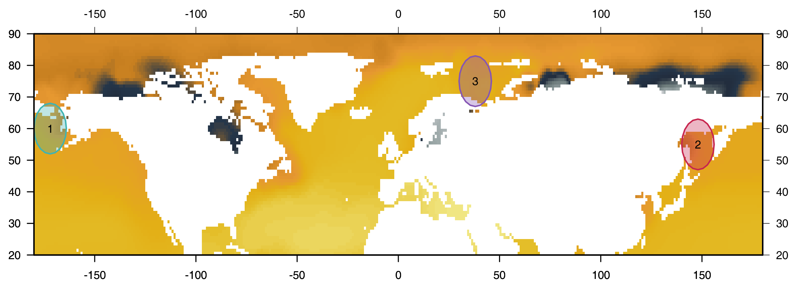

```{r setup, echo = F}
library(graphicsutils)
source("rscripts/figDens.R")
knitr::opts_chunk$set(
  comment = "#>",
  collapse = TRUE,
  warning = FALSE,
  message = FALSE,
  fig.width = 8,
  fig.height = 6,
  fig.align = 'center',
  width = 120
)
mypar <- list(fg = "#303940", bg = "transparent", mar = c(5, 2, 0, 2))
pal <- gpuPalette("insileco")
col2 <- "#3fb3b2"
col1 <- "#375771"
seqx <- seq(-10, 10, .05)
```


</img>

##  Fighting noise with dimensionality

##### The more biotracers the better!

<br><br>

##### <i class="fa fa-users" aria-hidden="true"></i> Kevin Cazelles &nbsp; .small[[McCannLab](https://www.mccannlab.org/)]

###### Emelia Myles-Gonzalez, Tyler Zemlak, Kevin S. McCann

<br>

.column2[

<br>

######  CSEE 2018 - University of Guelph
######  [KevCaz/fightingNoise](https://github.com/inSileco/KevCaz/fightingNoise) &nbsp;&nbsp;  [KCazelles](https://twitter.com/KCazelles)

]

.column2[
.right[]
.right[]
]


---
class: inverse, center, middle

# Before I start

## Facts that are worth mentionning


---

# Facts that are worth mentionning

<br>

### 1. I won't talk about any trophic interaction

### 2. Fish? hum, yes!

### 3. General ideas about inference (I'm the technical guy here)

### 4. Not trying to reinvent the wheel


---
class: inverse, center, middle

# Context

## The push for provenance


---
# The push for provenance

- Mean distance; food miles increased
- Zone where sustainable other not
- Zone where fishing is legal other where it is not
- Comsumer right-to-know
- Truthful product information

<!-- any produc e.g. fish palm oil globalization  -->
<!-- Country-of-Origin Labeling (COOL) -->

---
# Biotracers

#### Anything that could be informative:

- trace elements,
- isotoped signature,
- genetics data,
- gut contents,
- etc.


#### A "silver bullet" or a "shotgut shell"?

- Finding the best biotracers
- Or using together and build spatial fringerprint

---
# Questions

#### Where does it come from?

#### How to combine multiple source of information in this context?


<!-- https://www.alaskankingcrab.com/blogs/resources/blog-learn-fishing-for-king-crab -->


---
# Study case

<br>



1. Bering sea
2. Okhotsk sea
3. Barents sea


---
# Study case

#### Where does this King crab come from?

- [consumer right-to-know](http://thehill.com/blogs/congress-blog/education/214268-consumers-have-a-right-to-know-where-their-food-comes-from)
- sustainable fishery?

#### Has it been caught illegaly?

- illegal zone of fishery
- [caught illegaly](https://thefishsite.com/articles/alaska-fish-factor-king-crab-fishers-welcome-crack-down-on-illegal-fishing)


---
class: inverse, center, middle

# Theory

## a Bayesian framework

---
# Basic ideas

```{R fig0, echo = F}
par(mypar, mfrow = c(2,1), mar = c(3, 4, 0, 1))
figDens(seqx, ylim = c(0, .8), runif(8, -2, 2), runif(8, .5, 2), pal = colorRampPalette(c(col1, "grey80"))(8), xlab = "Biotracer 1", lwd = 3)
figDens(seqx, ylim = c(0, .8), runif(8, -2, 2), runif(8, .5, 2), pal = colorRampPalette(c(col1, "grey80"))(8), xlab = "Biotracer 2", lwd = 3)
```


---
# Basic ideas - dissimilarity

```{R fig1, echo = F}
par(mypar)
figDens(seqx, .1*c(-1, 1), pal = c(col1, col2), lwd = 3)
```

---
# Basic ideas - dissimilarity

```{R fig2, echo = F}
par(mypar)
figDens(seqx, 1*c(-1, 1), pal = c(col1, col2), lwd = 3)
```

---
# Basic ideas - dissimilarity

```{R fig3, echo = F}
par(mypar)
figDens(seqx, .15*c(-1, .1), sds = c(1, 2), pal = c(col1, col2), lwd = 3)
```

---
# Basic ideas - more dimensions

```{R fig4, echo = F}
par(mypar)
figOneDim(col1, col2)
```


---
# Basic ideas - more dimensions

```{R fig5, echo = F, fig.height = 4.8}
par(mypar)
par(mar = c(3, 3, 2, 2))
figTwoDims(col1, col2)
```

#####  Dimensionality  then relative overlap 


---
# Results

### The more the biotracers the better!

The curse of dimensionality in
becomes the blessing of dimensionality.

---
# Buiilding distribution

- major issue
- joint distrbution
- add Noise


---
# Spaial distribution


---
class: inverse, center, middle

# Does it work


---
class: inverse, center, middle

# Perspectives


---
# Cunterbalance weakness

Spatial fingerprint
extenten to sptail temporal finger print


---

# Modifying text


.column[

#### Classes

normal size ( $\LaTeX$-friendly terms)

`.huge[huge]` &nbsp; .huge[huge]

`.large[large]` &nbsp; .large[large]

`.small[small]` &nbsp; .small[small]

`.tiny[tiny]` &nbsp; .small[tiny]

]


.column[

#### Special class

- `.alert[alert]` .alert[alert]

- `.comment[comment]` .comment[comment]

#### Use remarkjs's macros

- `` to scale an image

- `` &nbsp; 

- `` &nbsp; 


]


---
class: inverse, center, middle

# THE END

## Thanks


---
# Thanks
