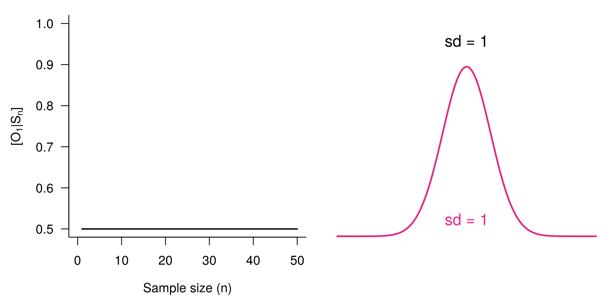
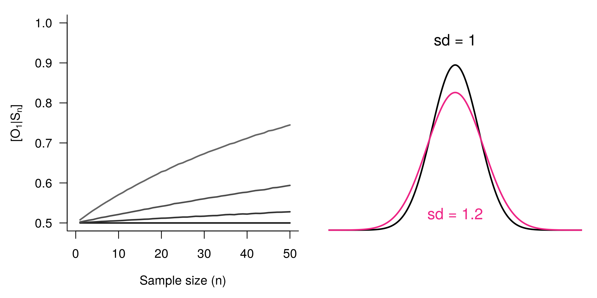
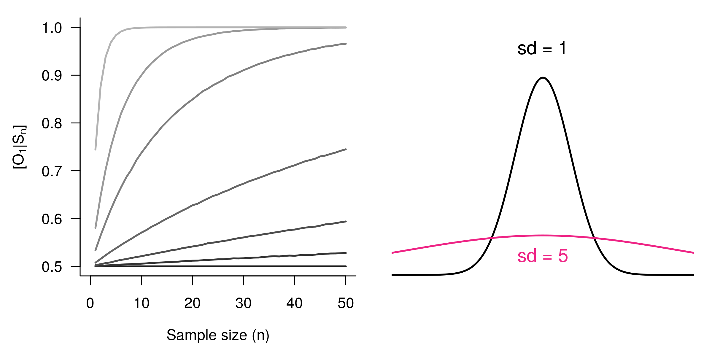
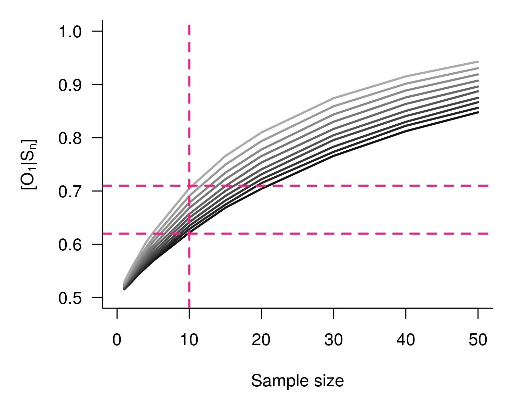

```{r setup, echo = F}
library(graphicsutils)
knitr::opts_chunk$set(
  comment = "#>",
  collapse = TRUE,
  warning = FALSE,
  message = FALSE,
  fig.width = 8,
  fig.height = 6,
  fig.align = 'center',
  width = 120
)
mypar <- list(fg = "1", bg = "transparent", mar = c(3, 3, 0, 3))
pal <- gpuPalette("insileco")
col2 <- "#ee2485"
col1 <- "#000000"# "#3fb3b2"
seqx <- seq(-10, 10, .05)
source("rscripts/figDens.R")
```


<br>


# .center[EMBRACING THE BLESSING OF DIMENSIONALITY TO DETERMINE SPECIES’ PROVENANCE]


<br><br><br><br>

### Kevin Cazelles &nbsp; .small[ [KCazelles](https://twitter.com/KCazelles)]

</img>


#### Emelia Myles-Gonzalez, Tyler Zemlak, Kevin S. McCann .small[[@McCannLab](https://www.mccannlab.ca/)]

<br><br>


####  QCBS Annual symposium, Montreal
####  December 18th, 2019
####  [KevCaz/fightingNoise](https://github.com/KevCaz/fightingNoise)


---
class: inverse, center, middle

# Context

<hr>

## The push for provenance

---
# The push for provenance
<br>

> Consumers are become increasingly aware of, and interested in, the origins
of their seafood, particularly as issues such as environmental sustainability,
impacts on endangered species, toxin accumulations, incidents of illegal,
unregulated and unreported (IUU) fishing, quality assurances and human
rights abuses are better understood.

 Roebuck, K. et al. (2017)
[Canadian's Eating in the Dark: A Report Card of International
Seafood Labelling Requirements](http://www.seachoice.org/wp-content/uploads/2017/03/Seafood-Labelling-Report-Online.pdf)


---
# The push for provenance

.center[]

 Roebuck, K. et al. (2017)
[Canadian's Eating in the Dark: A Report Card of International
Seafood Labelling Requirements](http://www.seachoice.org/wp-content/uploads/2017/03/Seafood-Labelling-Report-Online.pdf)


---
# Sockeye salmon (*Oncorhynchus nerka*)

.center[]

  Crawford, S.S. & Muir, A.M. (2008). [Global introductions of salmon and trout in the genus Oncorhynchus: 1870–2007](https://www.researchgate.net/publication/225224390_Global_introductions_of_salmon_and_trout_in_the_genus_Oncorhynchus_1870-2007). Reviews in Fish Biology and Fisheries.


---
# The push for provenance

<br>

### 1. We need regulations

#### .large[*e.g.* Country of Origin Labelling (COOL) in USA]

<br>

--

### 2. We need tools to authenticate the provenance

#### .large[[What this talk is about!]()]


---
# Biotracers to create spatial fingerprints

<br>

## Bio + tracer

### &nbsp; - trace elements
### &nbsp; - stable isotopes
### &nbsp; - fatty acids
### &nbsp; - DNA
### &nbsp; - gut contents
### &nbsp; - etc.


---
# Vertical vs horizontal strategies

<br>

>  The future of food authentication and food quality assurance critically
depends on combining chemometrics, computational analytical methods,
and bioinformatics in processing and interpreting the data obtained through
analytical technique.

 Danezis, G. P., et al. (2016)
[Food authentication: state of the art and prospects](https://www.sciencedirect.com/science/article/pii/S2214799316300844).
*Current Opinion in Food Science*

<br>


---
# Why develop horizontal strategies?

<br>


.center[]


 Chen, Dong, et al. (2013) [Blessing of Dimensionality: High-Dimensional Feature and Its Efficient Compression for Face Verification](https://www.cv-foundation.org/openaccess/content_cvpr_2013/html/Chen_Blessing_of_Dimensionality_2013_CVPR_paper.html). 2013 IEEE Conference on Computer Vision and Pattern Recognition.


---

<br><br><br><br><br><br>

# [HOW TO COMBINE BIO-TRACERS TO DETERMINE SPECIES PROVENANCE?]()


---
class: inverse, center, middle

# A Bayesian framework


---
# Where does this sample come from?


.center[]

---
# Where does this sample come from?

.center[]


---
# A Naive Bayes classifier


--

<br>

## - A priori knowledge

## - Sample (observations)

<br>

--

## - Quantity, quality, heterogeneity

<br>

--

## - Statistical model


---
# Origins and distributions

<br>

```{R figA2, echo = F, fig.height = 4.8, dpi = 150}
par(mypar)
figDens(seqx, means = c(-1, .5), sds = c(1, 1.5), pal = c(col1, col2), lwd = 3)
text(-1.6, .34, labels = "Origin 1", col = col1, pos = 2, cex = 2)
text(1.4, .22, labels = "Origin 2", col = col2, pos = 4, cex = 2)
```

---
# Where does this sample come from?

.center[]


---
# Problem

```{R figA3, echo = F, fig.height = 4.2, dpi = 150}
par(mypar)
figDens(seqx, means = c(-1, .5), sds = c(1, 1.5), pal = c(col1, col2), lwd = 3, ylim = c(0, .44))
text(-1.6, .34, labels = "Origin 1 TRUE", col = col1, pos = 2, cex = 2)
text(1.4, .22, labels = "Origin 2 FALSE", col = col2, pos = 4, cex = 2)
```

--

## O<sub>1</sub> | Sample ?

--

## Sample | O<sub>1</sub> &nbsp;&nbsp; & &nbsp;&nbsp; Sample | O<sub>2</sub> &nbsp;&nbsp; known!


---
# A bayesian approach

<br><br>

## [Assumptions]()

### 1. sample from one of the areas considered
### 2. no mixture


<br>

$$[O_1|S_{n}] = \frac{[S_{n}|O_1][O_1]}{\sum_j [S_{n}|O_j][O_j]}$$


---
# Similarity & authentication
<br>

.center[]


---
# Similarity & authentication
<br>

.center[]

---
# Similarity & authentication
<br>

.center[]

---
# Similarity & authentication
<br>

.center[]


---
# Similarity & authentication
<br>

.center[]


---
# Similarity & authentication
<br>

.center[]


---
# Similarity & authentication
<br>

.center[]


---
# Dimensionality & authentication

<br>

## [Assumption](): Bio-tracers ~ N(μ, Σ)

### just as in a [Linear Discriminant Analysis (LDA)]()

<br>

--

### μ: means - fixed

### Σ: covariance matrix

#### diagonal (variances) fixed

#### off-diagonal terms (symmetric) vary:


---
# Dimensionality & authentication

.center[]

---
# Dimensionality & authentication

.center[]

---
# Dimensionality & authentication

.center[]

---
# Dimensionality & authentication

.center[]

---
# Dimensionality & authentication

.center[]

---
# Dimensionality & authentication

.center[]

---
# Dimensionality & authentication

.center[]

---
# Dimensionality & authentication

.center[]

---
# Dimensionality & authentication

.center[]

---
# Dimensionality & authentication

.center[]

---
# Dimensionality & authentication

.center[]


---
# Dimensionality & authentication

.center[]

---
# Dimensionality & authentication

.center[]

--

## .center[[Blessing of dimensionality!]()]


---
# So
<br><br>

--

## 1. the more dissimilar the distributions the better

## 2. the higher the dimensionality the better

<br>

--

## 3. Assuming extra bio-tracer enhance 1. or 2. (or both)

--

<br>

## [THE MORE BIO-TRACERS THE BETTER]()


---
class: inverse, center, middle

# Using the framework


---
# Data
<br>

.column[

### - Sockeye Salmon

### - 3 regions

### - 30 individuals/region

### - bio-tracers:

### &nbsp;&nbsp;&nbsp;&nbsp; 3 stable isotopes
### &nbsp;&nbsp;&nbsp;&nbsp; 14 fatty acids

]


.column[

]


---
# How?

<br>

### - A priori knowledge 20 individuals | test on 10 individuals

### - All combinations of bio-tracers

### - Custom Bayes classifier / [LDA]() / Deep Learning

<br>
--

### cor(RU, US) > cor(CA, US) = cor(CA, RU)

---
# Results

.center[]


---
# Results

.center[]


---
class: inverse, center, middle

# Perspectives


---
# Perspectives
<br>

## [Limits]()

### Mixture problem
### Temporal variations

---
# Perspectives
<br>

## [Future]()

### Let's think vertical
### Can we use this to create reliable maps probabilities of origin?


-  Magozzi, S., et al. (2017) [Using ocean models to predict spatial and temporal variation in marine carbon isotopes.](https://data.giss.nasa.gov/o18data/grid.html) *Ecosphere*


---
# Many thanks to

<br><br>

--

### My co-authors and [the McCann Lab](https://www.mccannlab.org/)

<br><br>

--


### [Food From Thought](https://arrellfoodinstitute.ca/food-from-thought/)


---
class: inverse, center, middle

# THE END

