```{r setup, echo = F}
library(graphicsutils)
source("rscripts/figDens.R")
knitr::opts_chunk$set(
  comment = "#>",
  collapse = TRUE,
  warning = FALSE,
  message = FALSE,
  fig.width = 8,
  fig.height = 6,
  fig.align = 'center',
  width = 120
)
mypar <- list(fg = "#303940", bg = "transparent", mar = c(2, 2, 0, 2))
pal <- gpuPalette("insileco")
col2 <- "#3fb3b2"
col1 <- "#375771"
seqx <- seq(-10, 10, .05)
```

<!-- decktape --no-sandbox file:///home/kevcaz/Github/Talks/fightingNoise/index.html /home/kevcaz/Github/Talks/fightingNoise/fightingNoise_KC.pdf -->

</img>

##  Fighting noise with dimensionality

##### The more biotracers the better!

<br><br>

#####   Kevin Cazelles &nbsp; .small[[McCannLab](https://www.mccannlab.org/)]

###### Emelia Myles-Gonzalez, Tyler Zemlak, Kevin S. McCann

<br>

.column2[

<br>

######  CSEE 2018 - University of Guelph
######  [KevCaz/fightingNoise](https://github.com/KevCaz/fightingNoise) &nbsp;&nbsp;  [KCazelles](https://twitter.com/KCazelles)

]

.column2[
 &nbsp;
.right[ [](https://insileco.github.io/) ]
]


---
class: inverse, center, middle

# Before I start

## Facts that are worth mentioning


---

# Facts that are worth mentioning

<br>

### 1. I won't talk about any trophic interaction

--

### 2. Fish? hum, yes!

--

### 3. I'm not trying to reinvent the wheel


---
class: inverse, center, middle

# Context

## The push for provenance


---
# The push for provenance

<br>

> Consumers are become increasingly aware of, and interested in, the origins
of their seafood, particularly as issues such as environmental sustainability,
impacts on endangered species, toxin accumulations, incidents of illegal,
unregulated and unreported (IUU) fishing, quality assurances and human
rights abuses are better understood.

*  Roebuck, K. et al. (2017)
[Canadian's Eating in the Dark: A Report Card of International
Seafood Labelling Requirements](http://www.seachoice.org/wp-content/uploads/2017/03/Seafood-Labelling-Report-Online.pdf)


---
# The push for provenance

<br>

#### - We need regulations

##### *e.g.* Country of Origin Labelling (COOL) in USA

<br>

--

#### - We need tools to authenticate the provenance

#####  What this talk is about!


---
# Biotracers

#### Anything that could be informative...

- trace elements,
- isotopes (delta),
- genetics data,
- gut contents,
- etc.

#### ... to create spatial fingerprints


---
# A silver bullet?

<br>

>  The future of food authentication and food quality assurance critically
depends on combining chemometrics, computational analytical methods,
and bioinformatics in processing and interpreting the data obtained through
analytical technique.

*  Danezis, G. P., et al. (2016)
[Food authentication: state of the art and prospects](https://www.sciencedirect.com/science/article/pii/S2214799316300844).
*Current Opinion in Food Science*]


---
# Questions

<br>

## Where does this sample come from?

--

<br>

####   Why should we combine multiple sources of information in this context?


---
# Where does this this lot come from?


<br>

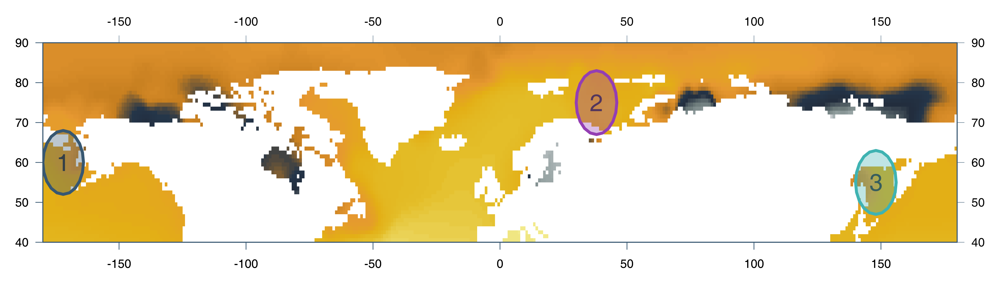

##### 1- Bering sea &nbsp;&nbsp; 2. Barents sea &nbsp;&nbsp; 3. Okhotsk sea

--
####  So... 1, 2, or 3?


<!-- https://www.alaskankingcrab.com/blogs/resources/blog-learn-fishing-for-king-crab -->


---
class: inverse, center, middle

# Theory

## a Bayesian framework


<!--need to define what is a meningful geographic area  -->


---
# Basic ideas - multiple origins

```{R figA1, echo = F, fig.height = 4.5}
par(mypar)
figDens(seqx, means = c(-1), sds = c(1), pal = c(col1, col2), lwd = 3)
text(-1.6, .34, labels = "Origin 1", col = col1, pos = 2, cex = 2)
```

---
# Basic ideas - multiple origins

```{R figA2, echo = F, fig.height = 4.5}
par(mypar)
figDens(seqx, means = c(-1, .5), sds = c(1, 1.5), pal = c(col1, col2), lwd = 3)
text(-1.6, .34, labels = "Origin 1", col = col1, pos = 2, cex = 2)
text(1.4, .22, labels = "Origin 2", col = col2, pos = 4, cex = 2)
```


---
# Basic ideas - multiple origins

```{R fig0, echo = F}
par(mypar, mfrow = c(2,1), mar = c(3, 4, 0, 1))
figDens(seqx, ylim = c(0, .8), runif(8, -2, 2), runif(8, .5, 2), pal = colorRampPalette(c(col1, "grey80"))(8), xlab = "Biotracer 1", lwd = 3)
figDens(seqx, ylim = c(0, .8), runif(8, -2, 2), runif(8, .5, 2), pal = colorRampPalette(c(col1, "grey80"))(8), xlab = "Biotracer 2", lwd = 3)
```

---
# Basic ideas - multiple origins

<br>

### .alert[Distributions are known]

--

### do not waste data, build relevant database!


---
# Basic ideas - multiple origins

```{R figA3, echo = F, fig.height = 4.25}
par(mypar)
figDens(seqx, means = c(-1, .5), sds = c(1, 1.5), pal = c(col1, col2), lwd = 3, ylim = c(0, .44))
text(-1.6, .34, labels = "Origin 1 TRUE", col = col1, pos = 2, cex = 2)
text(1.4, .22, labels = "Origin 2 FALSE", col = col2, pos = 4, cex = 2)
```

### &nbsp; O<sub>1</sub> | Sample ?  &nbsp;&nbsp;&nbsp;&nbsp;&nbsp;&nbsp;&nbsp; Sample | O<sub>i</sub> known!


---
# A bayesian apporach

<br>

- .alert[Assumptions]:

  - sample from one of the areas considered
  - no mixture

--

- .alert[Question] O<sub>1</sub> | S<sub>n</sub>?

--

- .alert[Method:] Bayesian inversion rule


<!-- $$[O_1|S_{n}] = \frac{[S_{n}|O_1][O_1]}{\sum_j [S_{n}|O_j][O_j]}$$ -->


---
# Theory - dissimilarity
<br>

.center[]


---
# Theory - dissimilarity
<br>

.center[]

---
# Theory - dissimilarity
<br>

.center[]

---
# Theory - dissimilarity
<br>

.center[]


---
# Theory - dissimilarity
<br>

.center[]


---
# Theory - dissimilarity
<br>

.center[]


---
# Theory - dissimilarity
<br>

.center[]


---
# Theory - dissimilarity
<br>

.center[]


---
# Theory - dissimilarity
<br>

.center[]

---
# Theory - dissimilarity
<br>

.center[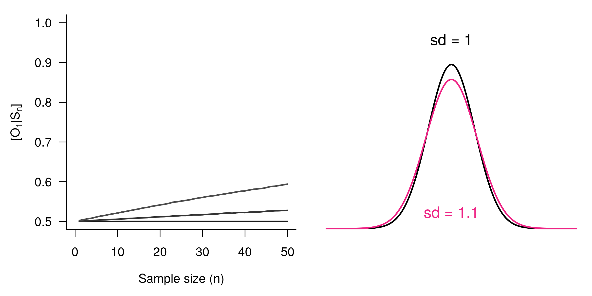]

---
# Theory - dissimilarity
<br>

.center[]


---
# Theory - dissimilarity
<br>

.center[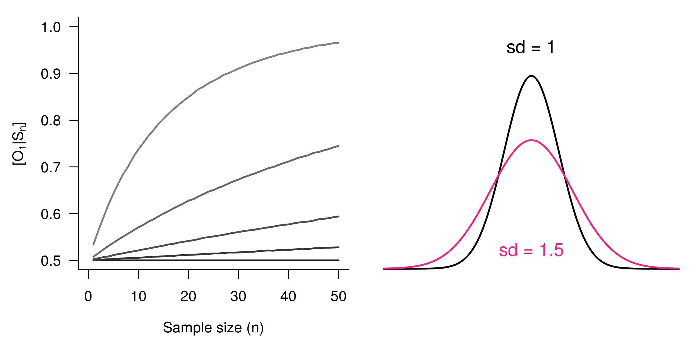]


---
# Theory - dissimilarity
<br>

.center[]


---
# Theory - dissimilarity
<br>

.center[]

--

##  The more dissimilar the better


---
# Theory - dimensionality


#### Biotracers ~ N(μ, Σ)

--

##### μ: means - fixed

--

##### Σ: covariance matrix

- diagonal (variances) fixed

- off-diagonal terms (symetric) vary:

.center[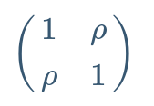]

<!-- \begin{pmatrix}
1 & \rho \\
\rho & 1
\end{pmatrix} -->


---
# Theory - dimensionality (dim = 2)

.center[]

---
# Theory - dimensionality (dim = 2)

.center[]

---
# Theory - dimensionality (dim = 2)

.center[]

---
# Theory - dimensionality (dim = 2)

.center[]

---
# Theory - dimensionality (dim = 2)

.center[]

---
# Theory - dimensionality (dim = 2)

.center[]

---
# Theory - dimensionality (dim = 2)

.center[]

---
# Theory - dimensionality (dim = 2)

.center[]

---
# Theory - dimensionality (dim = 2)

.center[]

---
# Theory - dimensionality (dim = 2)

.center[]

---
# Theory - dimensionality (dim = 2)

.center[]


---
# Theory - dimensionality (up to 10)

.center[]

---
# Theory - dimensionality (up to 10)

.center[]


---
# Results

<br>

#### 1. the more dissimilar the better

#### 2. any extra biotracer likely brings something new

#### 3. the more the biotracers the better!

<br>

--

#####  The curse of dimensionality becomes the blessing of dimensionality.


---
class: inverse, center, middle

# Applying the framework

## The King crab example

---
# King Crab - an example

<br>


--

#### - .alert[Question]: O<sub>1</sub>|S<sub>n</sub>?

---
# King Crab - an example

#### - .alert[Assumptions]:

#### * The sample is from one of the three areas

#### * No temporal variation

#### * No mixture


---
# King Crab - isoscapes

<br>


-  [Global Seawater Oxygen-18 Databass](https://data.giss.nasa.gov/o18data/grid.html)

---
# King Crab - isoscapes

<br>

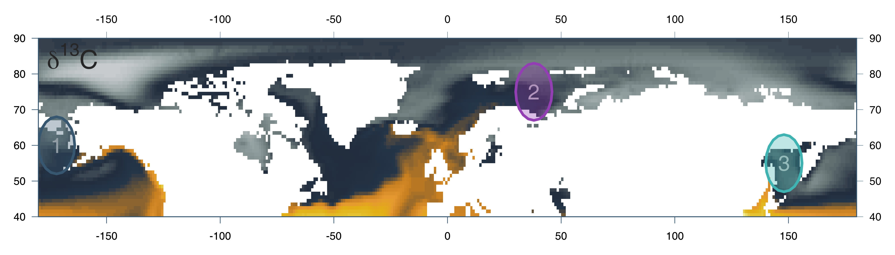

-  Magozzi, S., et al. (2017) [Using ocean models to predict spatial and temporal variation in marine carbon isotopes.](https://data.giss.nasa.gov/o18data/grid.html) *Ecosphere*


---
# King Crab - isoscapes

<br>

##  δ<sup>18</sup>O + δ<sup>13</sup>C

<br>

##  cor(δDp, δ<sup>18</sup>O) = .99


---
# King Crab - raw distribution

<br>

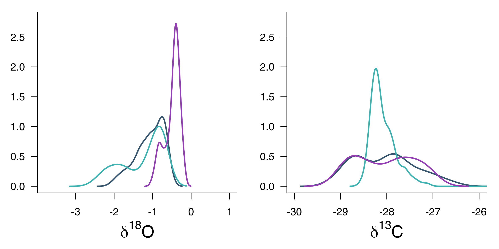

---
# King Crab - raw distribution

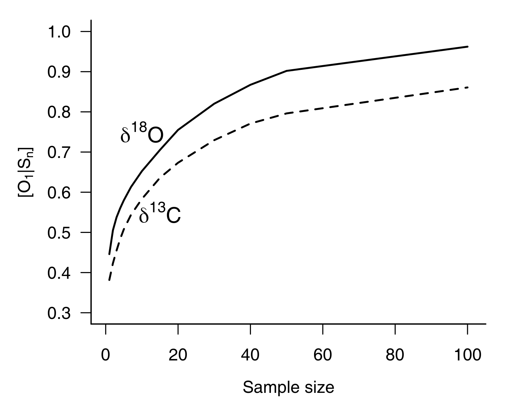

---
# King Crab - raw distribution

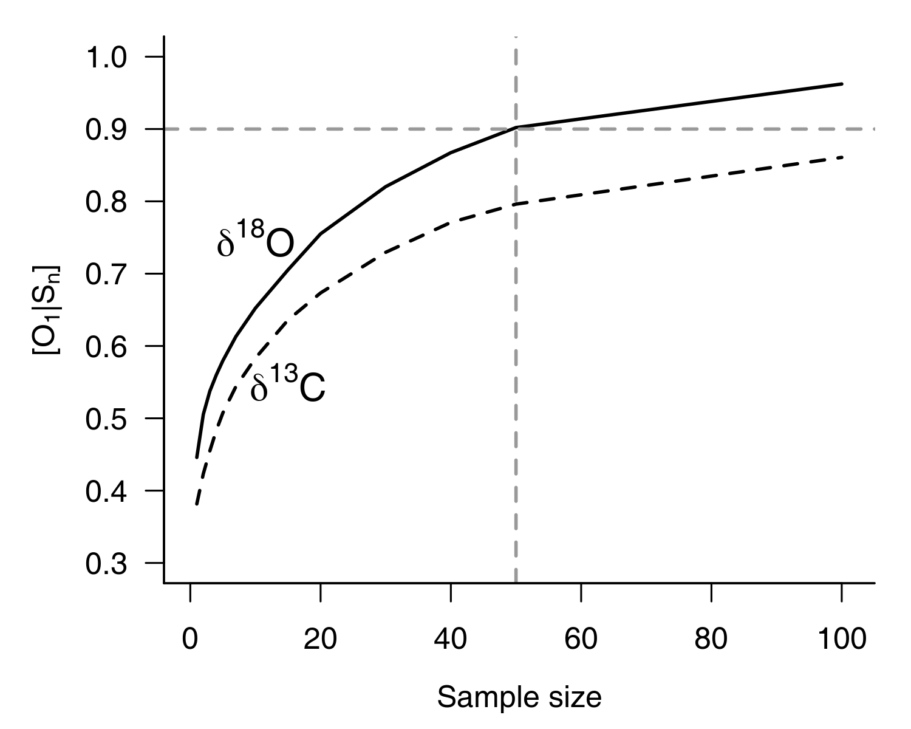

---
# King Crab - raw distribution

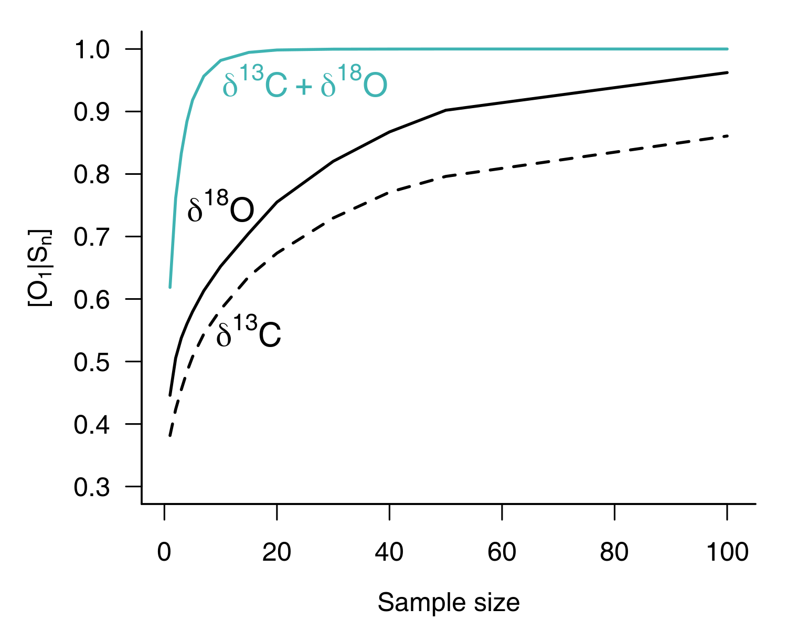

---
# King Crab - raw distribution

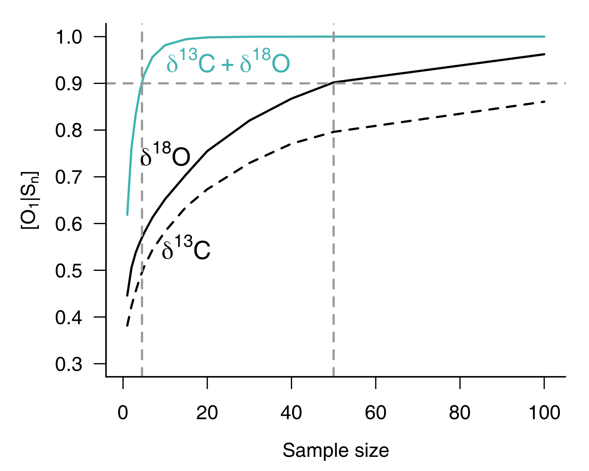


---
# King Crab - raw distribution

<br>


---
# King Crab - raw distribution + noise

<br>

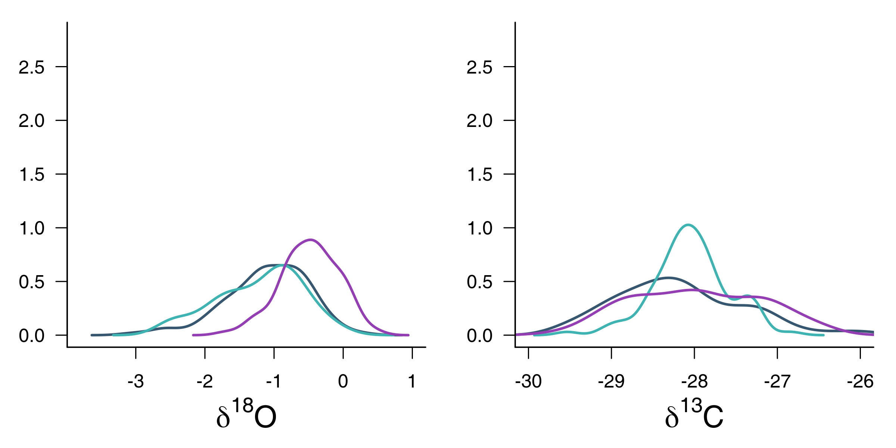

---
# King Crab - raw distribution

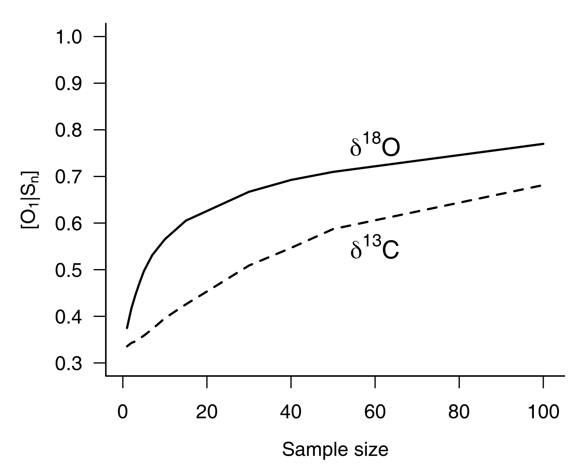

---
# King Crab - raw distribution


---
# King Crab - results

<br>

.column[
  
]

.column[
  
]

--

###  Fighting noise with dimensionality!


---
class: inverse, center, middle

# Perspectives


---
# Perspectives


##  Theory

  - Spatial autocorrelation
  - Mixture problem
  - Temporal variations

--

##   Applying the framework

  - More than 2 dimensions
  - Isoscape and more
  - Based on real samples


---
# Thanks to

--

### - my coauthors and [the McCannLab](https://www.mccannlab.org/)

--

### - [Food From Though](https://arrellfoodinstitute.ca/food-from-thought/)


--

### - [Biodiversity Resilience Network](http://birn.editmy.website/)


---
class: inverse, center, middle

# THE END


---
# Spatial correlation

# 


---
#  The more dissimilar the better

```{R fig1, echo = F, fig.height = 4.5}
par(mypar)
figDens(seqx, .1*c(-1, 1), pal = c(col1, col2), lwd = 3, ylim = c(0,.42))
text(-1, .3, labels = "Origin 1", col = col1, pos = 2, cex = 2)
text(1, .3, labels = "Origin 2", col = col2, pos = 4, cex = 2)
# tex
```

#### .alert[ Tricky!]


---
#  The more dissimilar the better

```{R fig2, echo = F, fig.height = 4.5}
par(mypar)
figDens(seqx, 1*c(-1, 1), pal = c(col1, col2), lwd = 3, ylim = c(0,.42))
text(-2, .3, labels = "Origin 1", col = col1, pos = 2, cex = 2)
text(2, .3, labels = "Origin 2", col = col2, pos = 4, cex = 2)
```

#### .alert[ Easier!]

---
#  The more dissimilar the better

```{R fig3, echo = F, fig.height = 4.5}
par(mypar)
figDens(seqx, .15*c(-1, .1), sds = c(1, 2), pal = c(col1, col2), lwd = 3)
text(-1, .3, labels = "Origin 1", col = col1, pos = 2, cex = 2)
text(1.2, .18, labels = "Origin 2", col = col2, pos = 4, cex = 2)
```

#### .alert[ Easier!]


---
# Basic ideas - more dimensions

```{R fig4, echo = F}
par(mypar)
figOneDim(col1, col2)
```

---
# Bayesian rule

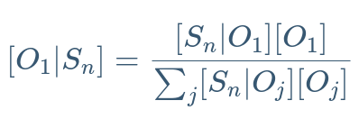


---
# Basic ideas - more dimensions

```{R fig5, echo = F, fig.height = 4.8}
par(mypar)
par(mar = c(3, 3, 2, 2))
figTwoDims(col1, col2)
```

#####  Dimensionality  then relative overlap 


---
# Study case - King Crab

#### Has it been caught illegaly?

> [For decades, Alaska crabbers have competed against king crab illegally caught by Russian fleets.](https://thefishsite.com/articles/alaska-fish-factor-king-crab-fishers-welcome-crack-down-on-illegal-fishing)

- illegal area / unauthorized fleets
- illegal, unreported and unregulated (IUU) fishing has tremendous economical consequences

#### Where does this lot of King crab come from?

- [consumer right-to-know](http://thehill.com/blogs/congress-blog/education/214268-consumers-have-a-right-to-know-where-their-food-comes-from)
- sustainable fishery?
