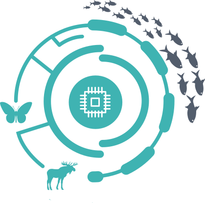

```{r setup, echo = F}
library(graphicsutils)
source("rscripts/figDens.R")
knitr::opts_chunk$set(
  comment = "#>",
  collapse = TRUE,
  warning = FALSE,
  message = FALSE,
  fig.width = 8,
  fig.height = 6,
  fig.align = 'center',
  width = 120
)
mypar <- list(fg = "#303940", bg = "transparent", mar = c(2, 2, 0, 2))
pal <- gpuPalette("insileco")
col2 <- "#3fb3b2"
col1 <- "#375771"
seqx <- seq(-10, 10, .05)
```


</img>

##  Fighting noise with dimensionality

##### The more biotracers the better!

<br><br>

##### <i class="fa fa-users" aria-hidden="true"></i> Kevin Cazelles &nbsp; .small[[McCannLab](https://www.mccannlab.org/)]

###### Emelia Myles-Gonzalez, Tyler Zemlak, Kevin S. McCann

<br>

.column2[

<br>

######  CSEE 2018 - University of Guelph
######  [KevCaz/fightingNoise](https://github.com/inSileco/KevCaz/fightingNoise) &nbsp;&nbsp;  [KCazelles](https://twitter.com/KCazelles)

]

.column2[
.right[]
.right[]
]


---
class: inverse, center, middle

# Before I start

## Facts that are worth mentionning


---

# Facts that are worth mentionning

<br>

### 1. I won't talk about any trophic interaction

### 2. Fish? hum, yes!

### 3. General ideas about inference (I'm the technical guy here)

### 4. Not trying to reinvent the wheel


---
class: inverse, center, middle

# Context

## The push for provenance


---
# The push for provenance

<br>

> Consumers are become increasingly aware of, and interested in, the origins
of their seafood, particularly as issues such as environmental sustainability,
impacts on endangered species, toxin accumulations, incidents of illegal,
unregulated and unreported (IUU) fishing, quality assurances and human
rights abuses are better understood.

Roebuck, K. 2017. [Canadians Eating in the Dark](http://www.seachoice.org/wp-content/uploads/2017/03/Seafood-Labelling-Report-Online.pdf).

- How to determine where a species come from?


---
# Biotracers

#### Anything that could be informative:

- trace elements,
- isotopes,
- genetics data,
- gut contents,
- etc.

#### tocreate a spatial fingerprint

---
# A silver bullet?

<br>

>  The future of food authentication and food quality assur-
ance critically depends on combining chemometrics,
computational analytical methods, and bioinformatics
in processing and interpreting the data obtained through
analytical technique.

Danezis, G. P., A. S. Tsagkaris, V. Brusic, and C. A. Georgiou. 2016.
[Food authentication: state of the art and prospects](https://www.sciencedirect.com/science/article/pii/S2214799316300844). Current Opinion in Food Science 10:22–31.


---
# Questions

<br>

## Where a given sample come from?

--

<br>

####  How to combine multiple source of information in this context?


<!-- https://www.alaskankingcrab.com/blogs/resources/blog-learn-fishing-for-king-crab -->


---
# Study case

--

<br>


1. Bering sea
2. Okhotsk sea
3. Barents sea


---
# Study case

#### Where does this lof of King crab come from?

- [consumer right-to-know](http://thehill.com/blogs/congress-blog/education/214268-consumers-have-a-right-to-know-where-their-food-comes-from)
- sustainable fishery?

--

<br>

#### Has it been caught illegaly?

- illegal zone of fishery
- [caught illegaly](https://thefishsite.com/articles/alaska-fish-factor-king-crab-fishers-welcome-crack-down-on-illegal-fishing)


---
class: inverse, center, middle

# Theory

## a Bayesian framework

---
# Basic ideas - multiple origins

<br>

#### One distribution:

##### - per biotracer

##### - and per geographic zone

<!--need to define what is a meningful geographic area  -->

<br>

--

#### .alert[Distributions are known]

##### - do not waste data

##### - build relevant data base


---
# Basic ideas - multiple origins


```{R fig0, echo = F}
par(mypar, mfrow = c(2,1), mar = c(3, 4, 0, 1))
figDens(seqx, ylim = c(0, .8), runif(8, -2, 2), runif(8, .5, 2), pal = colorRampPalette(c(col1, "grey80"))(8), xlab = "Biotracer 1", lwd = 3)
figDens(seqx, ylim = c(0, .8), runif(8, -2, 2), runif(8, .5, 2), pal = colorRampPalette(c(col1, "grey80"))(8), xlab = "Biotracer 2", lwd = 3)
```


---
# Basic ideas - dissimilarity

```{R fig1, echo = F, fig.height = 4.5}
par(mypar)
figDens(seqx, .1*c(-1, 1), pal = c(col1, col2), lwd = 3, ylim = c(0,.42))
text(-1, .3, labels = "Origin 1", col = col1, pos = 2, cex = 2)
text(1, .3, labels = "Origin 2", col = col2, pos = 4, cex = 2)
# tex
```

#### .alert[ Tricky!]


---
# Basic ideas - dissimilarity

```{R fig2, echo = F, fig.height = 4.5}
par(mypar)
figDens(seqx, 1*c(-1, 1), pal = c(col1, col2), lwd = 3, ylim = c(0,.42))
text(-2, .3, labels = "Origin 1", col = col1, pos = 2, cex = 2)
text(2, .3, labels = "Origin 2", col = col2, pos = 4, cex = 2)
```

#### .alert[ Easier!]

---
# Basic ideas - dissimilarity

```{R fig3, echo = F, fig.height = 4.5}
par(mypar)
figDens(seqx, .15*c(-1, .1), sds = c(1, 2), pal = c(col1, col2), lwd = 3)
text(-1, .3, labels = "Origin 1", col = col1, pos = 2, cex = 2)
text(1.2, .18, labels = "Origin 2", col = col2, pos = 4, cex = 2)
```

#### .alert[ Easier!]


---
# Basic ideas - more dimensions

```{R fig4, echo = F}
par(mypar)
figOneDim(col1, col2)
```


---
# Basic ideas - more dimensions

```{R fig5, echo = F, fig.height = 4.8}
par(mypar)
par(mar = c(3, 3, 2, 2))
figTwoDims(col1, col2)
```

#####  Dimensionality  then relative overlap 


---
# Basic ideas - Equations

<br>

- $S_{n}$ Sample of size $n$

- $[O_i|S_{n}]$: Probability the sample is from $O_i$ given the sample - .alert[unknown]

- $[S_{n}|Oi]$: Likelihood - .alert[known distributions (1, 2, ... dimensions)]

--

- .alert[Assumptions]:

  - sample from one of the area considered
  - no mixture


$$[O_i|S_{n}] = \frac{[S_{n}|O_i][O_i]}{\sum_j [S_{n}|O_j][O_j]}$$


---
# What does the theory say?

<br>

- Multinormal
- Increasing sample size
- Sample if from 1


---
# Results - dissimilarity
<br>

.center[]


---
# Results - dissimilarity
<br>

.center[]

---
# Results - dissimilarity
<br>

.center[]

---
# Results - dissimilarity
<br>

.center[]


---
# Results - dissimilarity
<br>

.center[]


---
# Results - dissimilarity
<br>

.center[]


---
# Results - dissimilarity
<br>

.center[]


---
# Results - dimensionality

<br>

.center[]

---
# Results - dimensionality

<br>

.center[]


---
# Results

### The more the biotracers the better!

The curse of dimensionality in
becomes the blessing of dimensionality.


---
class: inverse, center, middle

# Applying the framework

## The King crab example


---
# King Crab - data


---
# King Crab - assumptions


- No temporal variation

- Known relatioship between isoscape and tissue ratio

- No mixture


---
# King Crab - results


---
# King Crab - results


---
class: inverse, center, middle

# Applying the framework

## Salmon example


---
# Results


---
class: inverse, center, middle

# Perspectives


---

# Modifying text


.column[

#### Classes

normal size ( $\LaTeX$-friendly terms)

`.huge[huge]` &nbsp; .huge[huge]

`.large[large]` &nbsp; .large[large]

`.small[small]` &nbsp; .small[small]

`.tiny[tiny]` &nbsp; .small[tiny]

]


.column[

#### Special class

- `.alert[alert]` .alert[alert]

- `.comment[comment]` .comment[comment]

#### Use remarkjs's macros

- `` to scale an image

- `` &nbsp; 

- `` &nbsp; 


]


---
class: inverse, center, middle

# THE END

## Thanks


---
# Thanks
